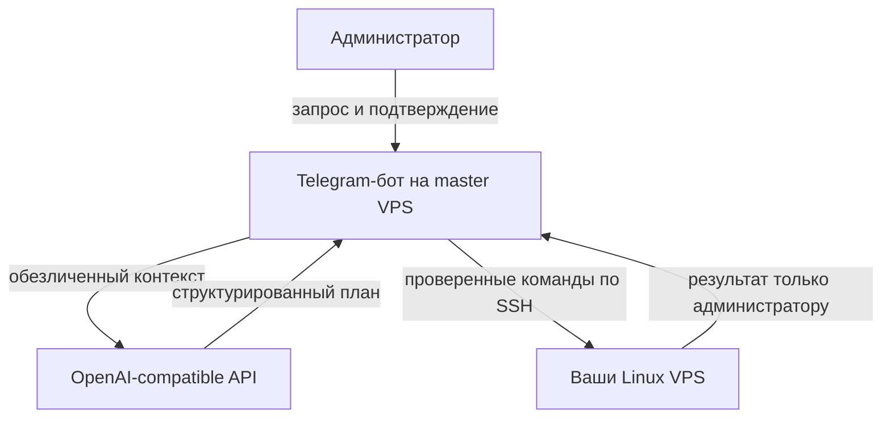

<p align="center">
  
</p>

# Yamori Master Bot

Закрытый Telegram-пульт для управления своими Linux VPS. AI превращает обычный запрос в проверяемый план, Yamori показывает точные команды и риск, а SSH-запуск начинается только после подтверждения администратора.

> AI plans. You approve. SSH executes.

Проект находится в публичном preview: интерфейсы и формат конфигурации ещё могут меняться.

## Зачем он нужен

Обычный AI-чат умеет советовать команды, но не знает, каким серверам можно доверять, кто дал разрешение и что уже было выполнено. Yamori Master добавляет контролируемый контур вокруг этого процесса:

- Telegram allowlist по admin ID — всем остальным бот молча не отвечает;
- подтверждение перед каждым API-запросом и каждым изменением на VPS;
- отдельный шестизначный код для критических операций;
- проверка SSH host fingerprint и отдельный Ed25519-ключ для каждого узла;
- шифрование API-ключа и приватных SSH-ключей;
- журнал действий, ограничение параллельности и таймауты;
- повторы при временных ошибках API `429/502/503/504`;
- один TXT для установки и обновления с backup, health-check и rollback.

## Как это работает



AI не подключается к серверам напрямую. Он не получает IP, SSH-логины, пароли, приватные ключи или вывод выполненных команд. Подробности: [модель безопасности](docs/SECURITY_MODEL.md).

## Установка или обновление

Требования: чистая master VPS с Ubuntu/Debian, root-доступ и интерактивный SSH-терминал.

1. Открой [yamori-master-install.txt](yamori-master-install.txt).
2. Проверь содержимое и скопируй блок целиком.
3. Вставь его в SSH-терминал master VPS.
4. Введи Telegram admin ID, bot token, API URL, ID модели и новый API-ключ.

На существующей установке в `/opt/yamori-master-bot` скрипт сохраняет `.env` и `data`, обновляет код, проверяет здоровье контейнера и откатывается при ошибке. Резервные копии лежат в `/opt/yamori-master-bot-backups/`.

Чтобы пересобрать TXT после изменения кода:

```bash
python3 tools/build_one_command.py
```

## Первый сценарий

1. Отправь боту `/start`.
2. Нажми `🖥 Серверы` → `➕ Добавить VPS`.
3. Сверь SHA256-отпечаток с консолью или панелью хостинга.
4. Нажми `✨ Новая задача` и опиши цель обычным текстом.
5. Проверь узлы, команды, таймаут и уровень риска.
6. Подтверди запуск. Для критической операции введи показанный код.

Быстрые команды:

```text
/ai покажи свободное место на всех VPS
/nodes
/addnode
/settings
/models
/audit
```

## Границы безопасности

| Механизм | Что он снижает | Чего не гарантирует |
|---|---|---|
| Admin allowlist | Доступ посторонних к интерфейсу | Безопасность скомпрометированного аккаунта администратора |
| Подтверждения | Случайный запуск без просмотра | Корректность команды, которую администратор сознательно одобрил |
| Host fingerprint | Подмену VPS при первом/повторном соединении | Чистоту самой VPS |
| Шифрование секретов | Чтение ключей из базы без `MASTER_KEY` | Защиту при полном root-доступе к master VPS |
| Проверка команд | Часть опасных и некорректных конструкций | Полноценную песочницу для shell |

Используй отдельную master VPS, HTTPS API, непривилегированного SSH-пользователя и минимальные `sudo`-права. Не публикуй `.env`, `data/bot.db`, токены или установочные логи. Ключ, попавший в чат или GitHub, нужно немедленно отозвать.

HTTP API разрешается только после явного ввода `ПОНИМАЮ`: без TLS владелец сети может перехватить ключ, запросы и ответы. Ошибка HTTP 503 обычно означает временный сбой стороннего шлюза; после трёх неудачных попыток Yamori ничего по SSH не запускает.

## Настройки и API

В боте можно менять модель, API URL, API-ключ, режим авторизации, TLS/HTTP, таймаут, SSH-параллельность, групповой режим и префикс. Для опытных пользователей доступны `/setmodel`, `/setapiurl`, `/setapikey`, `/setauth`, `/setallowhttp`, `/settimeout`, `/setparallel`, `/setgroupmode`, `/setprefix`.

Кнопка `🛒 Где купить API` ведёт на [страницу поставщика на FunPay](https://funpay.com/users/20118212/). Это сторонний продавец, не связанный с проектом: самостоятельно проверяй происхождение доступа, условия, приватность и надёжность сервиса.

## Обслуживание

```bash
cd /opt/yamori-master-bot
docker compose ps
docker compose logs -f --tail=100
docker compose restart
```

Для восстановления нужны вместе `data/bot.db` и исходный `MASTER_KEY` из `.env`.

## Разработка

```bash
python3 -m venv .venv
. .venv/bin/activate
pip install -r requirements.txt ruff
ruff check app tests
python -m unittest discover -s tests -v
bash tests/test_installer.sh
cp .env.example .env && docker compose config --quiet
```

Правила участия: [CONTRIBUTING.md](CONTRIBUTING.md). Уязвимости: [SECURITY.md](SECURITY.md). Изменения: [CHANGELOG.md](CHANGELOG.md).

Лицензия пока не выбрана; публичный доступ к исходникам сам по себе не означает разрешение на копирование или распространение.
